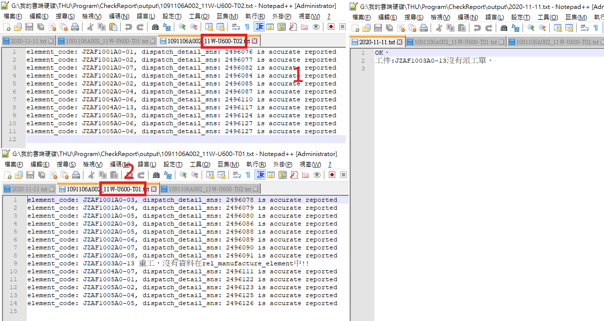

# 操作手冊

1. 若發現Uipath未正常運作請依據下面步驟進行確認

    * WIFI 請連線 AICenter5
	* 請檢查 `C:\Users\User\AppData\Local\UiPath` 底下的app-xx資料夾是否編號有大於 app-20.10.2-beta0004
    * ex: app-20.10.4-beta0001 表示有新版，請在工作排成器中檢查 名稱為`AutoDownloadCheckReportExcel`的動作裡面的程式或指令碼是否指向最新，若沒有請將指向最新，更新方式點開`瀏覽`選擇最新的資料夾中的`UiRobot.exe`，並按確認
    * 最後點選工作排程主頁中的 `AutoDownloadCheckReportExcel` 右鍵執行
    * 下載的excel會存放在 `G:\我的雲端硬碟\THU\CheckReport\鐳射發料.xlsx`
* 註. 機器人會自動下載 excel 以及過濾欄位，非必要請勿亂動
2. 打開 `檢查報工.xlsx並找到最下面的一筆訂單編號` 利用此訂單編號在`鐳射發料.xlsx`中尋找，並從上次檢查完畢後的的訂單編號開始往後複製並貼上到 `檢查報工.xlsx` (格式已是先處理好)
3.  開啟網頁輸入`127.0.0.1:1010`，第一個input是輸入訂單號碼，第二個是輸入排版圖編號(小提醒:排版圖可以在 excel 直接複製一整排，但僅限同訂單以及同機台，且不需額外處理直接貼到網頁上)，選擇使用機台對應 excel 中的TK or FOM2，前者是使用機器為:EML3610-TK，後者是FOM2-3015-1，接下來選擇雷射製程，最後選擇報工日期請依據excel中的時記完工日選擇，最後按下查詢，查詢完畢後會顯示成功訊息，若不幸發生Index:0 的訊息請直撥成功嶺電話XD
4. 最後搜尋結果會輸出在 `G:\我的雲端硬碟\THU\Program\CheckReport\output\yyyy-mm-dd.txt` ，將檔案內容複製貼上到 `檢查報工.xlsx`的檢查結果及原因。
   * ex: 查詢訂單: 1091106A002 排版圖編號:11W-U600-T02、11W-U600-T01，搜尋結果如下圖，第一張排版圖是`11W-U600-T02`，此張排版圖都正確報工因此在yyyy-mm-dd.txt會顯示為OK；第二章排版圖是有問題的因此對應到yyyy-mm-dd.txt可以單獨顯示存在哪些問題

